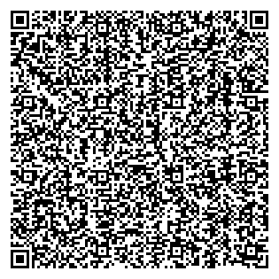
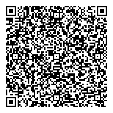

# 0000: Compressing DIDComm messages using dictionaries (Ex. 0000: RFC Topic)
- Authors: [Kim Ebert](kim@indicio.tech)
- Status: [PROPOSED](/README.md#proposed)
- Since: 2022-
- Status Note: Compression theory  
- Supersedes: 
- Start Date: 2022-03-10
- Tags: [concept](/tags.md#concept)

## Summary

Using Dictionary Compression, higher compression rates can be achieved for small messages with known entries.

## Motivation

DIDComm messages contain well know values and are often short in size. Using dictionary based compression may reduce the overall size of messages that may be transmitted or stored.

## Tutorial

### Training

The first step is to determine the type of data that needs to be provided for training, and generating a number of requests that meets that criteria.

An example of creating such an invite using Aca-py and curl

```
curl -X POST "http://127.0.0.1:8150/out-of-band/create-invitation" -H "accept: application/json" -H "Content-Type: application/json" -d "{ \"alias\": \"\", \"attachments\": [ ], \"handshake_protocols\": [ \"did:sov:BzCbsNYhMrjHiqZDTUASHg;spec/didexchange/1.0\" ], \"metadata\": {}, \"my_label\": \"\", \"use_public_did\": false}"
```

Result:

```
{"invitation_url": "https://localhost:443?oob=eyJAdHlwZSI6ICJkaWQ6c292OkJ6Q2JzTlloTXJqSGlxWkRUVUFTSGc7c3BlYy9vdXQtb2YtYmFuZC8xLjAvaW52aXRhdGlvbiIsICJAaWQiOiAiYTYwZDhlYTAtZDg1Zi00NDJkLTk0NTktZTk2NWEyYjg3Nzg1IiwgInNlcnZpY2VzIjogW3siaWQiOiAiI2lubGluZSIsICJ0eXBlIjogImRpZC1jb21tdW5pY2F0aW9uIiwgInJlY2lwaWVudEtleXMiOiBbImRpZDprZXk6ejZNa296SGNjNzI0ajlGOFJBR214bTFOY3hpVlhtOE10c0NMQ0paWktacWRwd0Z3Il0sICJyb3V0aW5nS2V5cyI6IFsiZGlkOmtleTp6Nk1rcTNycDg1cm1qTjRwdnN5WUpWTlZoVXZBNUJwTWFlNkd5MlBUUzVZaHdVelIiLCAiZGlkOmtleTp6Nk1rbnZwTmEzQXdWOHl6SHJaM0s3WXVDdU1adXBiSEt0ZDJwVDN4U3NzODRqenEiXSwgInNlcnZpY2VFbmRwb2ludCI6ICJodHRwczovL21lZGlhdG9yNC50ZXN0LmluZGljaW90ZWNoLmlvOjQ0MyJ9XSwgImhhbmRzaGFrZV9wcm90b2NvbHMiOiBbImRpZDpzb3Y6QnpDYnNOWWhNcmpIaXFaRFRVQVNIZztzcGVjL2RpZGV4Y2hhbmdlLzEuMCJdLCAibGFiZWwiOiAiTGFiIn0=", "invitation": {"@type": "did:sov:BzCbsNYhMrjHiqZDTUASHg;spec/out-of-band/1.0/invitation", "@id": "a60d8ea0-d85f-442d-9459-e965a2b87785", "services": [{"id": "#inline", "type": "did-communication", "recipientKeys": ["did:key:z6MkozHcc724j9F8RAGmxm1NcxiVXm8MtsCLCJZZKZqdpwFw"], "routingKeys": ["did:key:z6Mkq3rp85rmjN4pvsyYJVNVhUvA5BpMae6Gy2PTS5YhwUzR", "did:key:z6MknvpNa3AwV8yzHrZ3K7YuCuMZupbHKtd2pT3xSss84jzq"], "serviceEndpoint": "https://localhost:443"}], "handshake_protocols": ["did:sov:BzCbsNYhMrjHiqZDTUASHg;spec/didexchange/1.0"], "label": "Lab"}, "state": "initial", "trace": false, "invi_msg_id": "a60d8ea0-d85f-442d-9459-e965a2b87785"}
```

We then extract the data required for the invitation.

```
{"@type": "did:sov:BzCbsNYhMrjHiqZDTUASHg;spec/out-of-band/1.0/invitation", "@id": "2dbf6f36-8dc0-4b35-9558-dab26e3ae3c3", "services": [{"id": "#inline", "type": "did-communication", "recipientKeys": ["did:key:z6MkqfRyf4ycr6HFpo4XyhQp8gBwdBW51Z2yXnxg11AuFZT6"], "routingKeys": ["did:key:z6Mkq3rp85rmjN4pvsyYJVNVhUvA5BpMae6Gy2PTS5YhwUzR", "did:key:z6MknvpNa3AwV8yzHrZ3K7YuCuMZupbHKtd2pT3xSss84jzq"], "serviceEndpoint": "https://localhost:443"}], "handshake_protocols": ["did:sov:BzCbsNYhMrjHiqZDTUASHg;spec/didexchange/1.0"], "label": "Lab"}
```

Finally, we strip out the keys that are specific to the local agent, leaving content that can easily be compressed.

```
{"@type": "did:sov:BzCbsNYhMrjHiqZDTUASHg;spec/out-of-band/1.0/invitation", "@id:": "", "services": [{"id": "#inline", "type": "did-communication", "recipientKeys": ["did:key:"], "routingKeys": ["did:key:", "did:key:"], "serviceEndpoint": "https://:443"}], "handshake_protocols": ["did:sov:BzCbsNYhMrjHiqZDTUASHg;spec/didexchange/1.0"], "label": "Lab"}
```

We do this a hundred or so times, and include other configuration options of interest. ( Research into what should be included here could provide some value )

We then create the dictionary.

```
zstd --train ./data/* -o dict
```

This dictionary can now be used to compress the data before it is base64 encoded into the url.

### The Compressed Out of Band Message

Using a unique url parameter for compressed out of band messages, the client can determine the alternative behavior to follow.

The coob message includes the following binary data. The first 4 bytes indicate the dictary to be used, perhaps as an unsiged long. Or alternatively we could use a d= parameter for the storage of the dictionary id.

Dictionary IDs would be used to indicate which dictionary the client should use. Occassionally, ARIES may release a new dictionary. This new dictionary should not be used for limited time to allow all clients to get the latest dictionaries. These dictionaries could be auto-retrieved by the clients when connection to the internet is available.

The rest of the coob data is the a compressed zstd binary output. After the binary data is combined together, the data is base64url encoded.

```
https://localhost:443?c=sztd&d=1&oob=KLUv_Wc3PnoBMAG1BgBijCwjEIfWAzs-1Bd8YPpweoDAqvElxVlFB2t_B0mLRHdVVVVVwQ1ZRjAL7yxb-TIysjm8Ed-yTeWLF1qo8MlxiEaMtHI3fSrdFbppodFuTwhO6WsiVbU3ECY-bHpEdFBAg8QUpAG-8RKYVKWACeQ87VWx2H7qLWqW-QNtLAt11M6HIEmkxwYucGqk1akI2O1ABcPSONJHGQaQDJnr8mtWyfL4Ho4t6nhZ-XGX-8dUCIn_JQ8CCgCVXyJ1RAnO_AEwww7QY1FQCCwIETfkSRDzzwJ-R-kV6uOdbQ==
```

The URL is reduced from 794 bytes to 370 bytes.(46.6 % of original size) There difference in the QR codes can be seen below.




### Redirect on failure

If the client cannot decode the coob message, or does not have the appropriate dictionary, the client can visit the url and will be redirected to the decompressed url.

## Dictionary Storage

Dictionaries could be stored along side the RFCs, or an alternative method for transfering dictionaries between clients could be derived.

## Drawbacks

Dictionaries may need to be regularly rebuilt to adjust to new protocols. Some dictionaries may not provide any compression benefits depending upon the message.

## Rationale and alternatives


## Prior art

[zstd] (http://facebook.github.io/zstd/)
[zstd manual](https://github.com/facebook/zstd/blob/dev/programs/zstd.1.md)

## Unresolved questions

- Where are dictionaries stored
- How do we specify compression will be used for DIDComm messages
- What to do when a client doesn't support compression.
   
## Implementations

*Implementation Notes* [may need to include a link to test results](/README.md#accepted).

Name / Link | Implementation Notes
--- | ---
 | 

